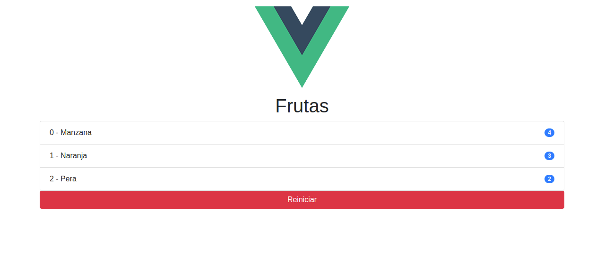

# proyecto-01

### Vue js 2 Completo ¡De 0 a Experto! + Firebase + Node [MEVN]
### Vue.js 2 Aprende con la práctica, descubriendo Vuex, Rutas protegidas, Vue CLI 3 UI, Nuxt.js, Node.js, Express y MongoDB

### Vue CLI 3 y VUEX | Contador de Frutas
- Crear primeros componentes
- mapState con Vuex
- mapMutation con Vuex
- Ordenar Array - Finalizando proyecto

